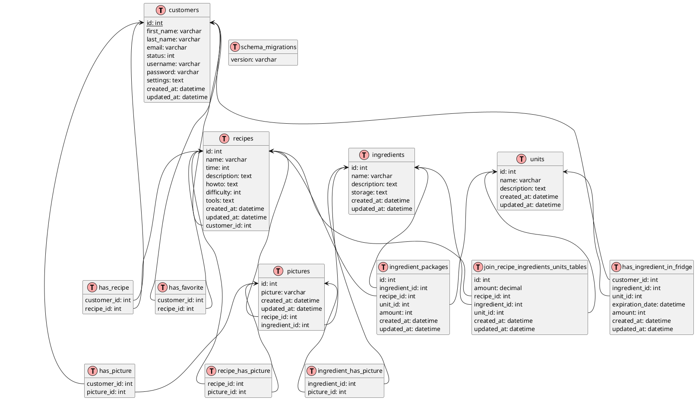

# RIS
## Datenbank

```puml
@startuml
!define table(x) class x << (T,#FFAAAA) >>
!define primary_key(x) <u>x</u>
hide stereotypes
hide methods

table(customers) {
  primary_key(id: int)
  first_name: varchar
  last_name: varchar
  email: varchar
  status: int
  username: varchar
  password: varchar
  settings: text
  created_at: datetime
  updated_at: datetime
}

table(has_favorite) {
  customer_id: int
  recipe_id: int
}

table(has_ingredient_in_fridge) {
  customer_id: int
  ingredient_id: int
  unit_id: int
  expiration_date: datetime
  amount: int
  created_at: datetime
  updated_at: datetime
}

table(has_picture) {
  customer_id: int
  picture_id: int
}

table(has_recipe) {
  customer_id: int
  recipe_id: int
}

table(ingredient_has_picture) {
  ingredient_id: int
  picture_id: int
}

table(ingredient_packages) {
  id: int
  ingredient_id: int
  recipe_id: int
  unit_id: int
  amount: int
  created_at: datetime
  updated_at: datetime
}

table(ingredients) {
  id: int
  name: varchar
  description: text
  storage: text
  created_at: datetime  
  updated_at: datetime
}

table(join_recipe_ingredients_units_tables) {
  id: int
  amount: decimal
  recipe_id: int
  ingredient_id: int
  unit_id: int
  created_at: datetime
  updated_at: datetime
}

table(pictures) {
  id: int
  picture: varchar
  created_at: datetime
  updated_at: datetime
  recipe_id: int
  ingredient_id: int
}

table(recipe_has_picture) {
  recipe_id: int
  picture_id: int
}

table(recipes) {
  id: int
  name: varchar
  time: int
  description: text
  howto: text
  difficulty: int
  tools: text
  created_at: datetime
  updated_at: datetime
  customer_id: int
}

table(schema_migrations) {
  version: varchar
}

table(units) {
  id: int
  name: varchar
  description: text
  created_at: datetime
  updated_at: datetime
}

units::id <-- ingredient_packages::unit_id
units::id <-- join_recipe_ingredients_units_tables::unit_id
units::id <-- has_ingredient_in_fridge::unit_id
pictures::id <-- ingredient_has_picture::picture_id
pictures::id <-- recipe_has_picture::picture_id
pictures::id <-- has_picture::picture_id
customers::id <-- has_picture::customer_id
customers::id <-- has_favorite::customer_id
customers::id <-- has_recipe::customer_id
customers::id <-- recipes::customer_id
customers::id <-- has_ingredient_in_fridge::customer_id
recipes::id <-- ingredient_packages::recipe_id
recipes::id <-- has_recipe::recipe_id
recipes::id <-- has_favorite::recipe_id
recipes::id <-- pictures::recipe_id
recipes::id <-- join_recipe_ingredients_units_tables::recipe_id
recipes::id <-- recipe_has_picture::recipe_id
ingredients::id <-- ingredient_has_picture::ingredient_id
ingredients::id <-- ingredient_packages::ingredient_id
ingredients::id <-- join_recipe_ingredients_units_tables::ingredient_id
ingredients::id <-- pictures::ingredient_id

@enduml
```
